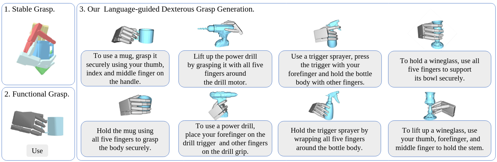
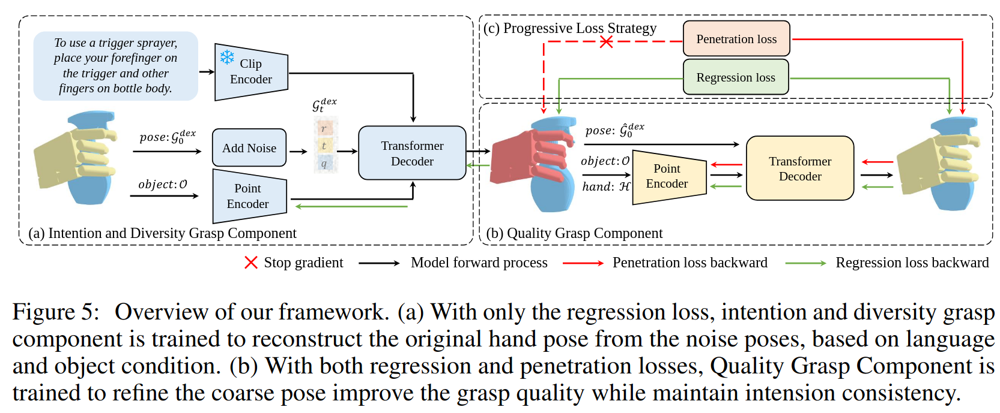

# Grasp as You Say: Language-guided Dexterous Grasp Generation

## 基本信息
- **作者**：Yi-Lin Wei1, Jian-Jian Jiang1, Chengyi Xing2, Xian-Tuo Tan1, Xiao-Ming Wu1, Hao Li2, Mark Cutkosky2, Wei-Shi Zheng1,3†
- **单位**：中山大学
- **发表时间**：2024
- **期刊/会议**：arXiv
- **DOI**：arXiv:2405.19291
- **引用次数**：14
- **论文链接**：https://arxiv.org/abs/2405.19291
- **代码/项目链接**：https://isee-laboratory.github.io/DexGYS/

## 研究类型
- [ ] 综述（Survey）
  - [ ] 领域综述
  - [ ] 方法综述
  - [ ] 应用综述
- [x] 方法（Method）
  - [x] 基于学习
    - [ ] 强化学习
    - [ ] 模仿学习
    - [ ] 迁移学习
  - [ ] 基于优化
    - [ ] 轨迹优化
    - [ ] 接触点优化
    - [ ] 力优化
  - [ ] 基于控制
    - [ ] 阻抗控制
    - [ ] 力控制
    - [ ] 混合控制
- [ ] 应用（Application）
  - [ ] 工业应用
  - [ ] 服务机器人
  - [ ] 特殊场景

## 核心内容

### 研究问题
- 研究背景：引言中有提到functional dexterous grasping[8,9,10,19]，然而这些方法依赖于预定义的，固定的有限的任务或功能。

- 研究目标：用人类语言引导灵巧抓取生成
- 主要挑战： 
  1. **数据标注成本高**：灵巧手姿态和对应语言指导的标注成本高昂，这为开发和扩展灵巧手数据集带来了障碍。
  
  2. **模型学习难度大**：需要同时满足以下要求：
     - 意图对齐：生成的抓取姿态需要与语言指令保持一致
     - 高质量：抓取姿态需要稳定可靠
     - 多样性：能够生成多种不同的抓取方式

### 主要方法
- 技术路线：提出了一种大语言指导的灵巧抓取数据集**DexGYSNet**, DexGYSNet dataset comprises 50,000 pairs of high-quality dexterous grasps and their corresponding language guidance; 提出了**DexGYSNGrasp**,将抓取分成了两个阶段，第一阶段意图对齐，第二阶段，微调以生成高质量的抓取。
- 创新点：语言指导的抓取生成
- 关键算法：**DexGYSNGrasp**
- **DexGYSNet**数据集：从一个原有的人类抓取数据集[27]收集物体mesh和人类抓取，使用了一种Hand-Object Interaction Retargeting (HOIR) 方法，先使用基本关键点优化目标，然后又加入了其他的一些损失项来refine抓取的pose，然后从人类意图（(e.g., "using a lotion pump"）和**接触信息的语言描述** (e.g. "forefinger touches pump head and other fingers touch the bottle body."）生成自然语言注释指导 (e.g. "To use a lotion pump, press down on the pump head with your forefinger while holding the bottle with your other fingers."）
- **DexGYSNGrasp** 框架：给定物体点云和语言指导，生成抓取。第一阶段使用diffuison model来预测抓取姿态，用CLIP编码的语言作为条件，第二阶段加入了回归损失和渗透损失来生成高质量抓取。

### 实验结果
- 实验设置：he experiments are conducted on an Allegro hand, a Flexiv Rizon 4 arm and an Intel Realsense D415 camera. partial object point clouds are obtained through visual grounding [53] and SAM [54], which are then fed into a point cloud completion network [55] to obtain full point clouds
- 评估指标：意图、质量多样性等
- 主要结果：
- 对比分析：

### 局限性
- 方法局限：
- 实验局限：
- 应用局限：

## 个人思考

### 方法评价
- 优点：
- 缺点：
- 可改进点：

### 潜在改进
- 算法改进：
- 实验改进：
- 应用扩展：

### 相关论文
- 前置工作：DGTR：Dexterous Grasp Transformer
- 后续工作：
- 相关领域：

### 实践建议
- 实现建议：
- 应用建议：
- 注意事项：

## 阅读笔记
- 阅读时间：
- 阅读状态：[未读/在读/**已读**]
- 重要程度：[高/**中**/低]
- 是否需要复现：[是/否/**不确定**]

## 其他备注
- 补充说明：
- 待解决问题：
- 参考资料： 